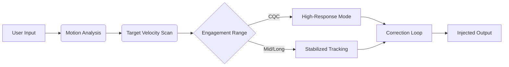

## ✨ Overview

Unlike static aim tools, this module reads your current motion, target velocity, and engagement context to **adjust its behavior mid-fight**.
It pulses between micro-corrections and aggressive tracking, letting you stay sharp without feeling constrained.

Think of it as an algorithmic dance partner—one that understands when to glide and when to sprint.

---

## 🎯 Features

* **Contextual Tracking Engine**
  Reacts in real time to enemy acceleration, strafes, jumps, and slide entries.
* **Auto-Shift Precision Zones**
  Expands or tightens your aim FOV based on distance thresholds or your firing mode.
* **Kinetic Smoothing Layer**
  Smoothing dynamically changes with your weapon recoil or movement speed.
* **Error-Correction Loop**
  Closes micro gaps in alignment using predictive jitter compensation.
* **Adaptive Burst Sync**
  Syncs with fire patterns to boost hit probability during high-pressure trades.
* **Ultra-Low Latency Driver**
  Averages 1.4–1.6 ms response on Windows 10/11.

---

## 🧩 Compatibility

| Platform     | Status     | Notes                                |
| ------------ | ---------- | ------------------------------------ |
| Windows 10   | ✔️         | Full dynamic engine support          |
| Windows 11   | ✔️         | Best performance & minimal input lag |
| Linux (Wine) | ⚠️ Partial | Adaptive smoothing may fail to load  |

[!NOTE]
The module includes optional assist layers for players needing gentler sensitivity profiles or steady-hand compensation.

---

## ⚡ Setup

A dynamic engine begs to be tuned. Here’s the path:

1. Download the module package
2. Extract to a preferred folder
3. Open `DynamicAim.exe` as Administrator
4. Choose a *Mode Profile* (e.g., **“Fluid Strike v2”**)
5. Fine-tune reaction speed and shift thresholds

### Sample Config (Mid-Range Hybrid)

```json
{
  "baseFov": 6.2,
  "dynamicFovMin": 3.0,
  "dynamicFovMax": 9.5,
  "reactionSpeed": 0.38,
  "burstAssist": true,
  "errorCorrection": 0.27
}
```

### Close-Quarters Pressure Preset

```ini
fov_min=2.4
fov_max=7.8
kinetic_smoothing=0.61
burst_window=16
adaptive_curve=reactive
```

[!IMPORTANT]
Disable in-game mouse filtering or aim acceleration—dynamic modules rely on raw input consistency.

---

## 🌀 Mermaid Diagram: Adaptive Cycle



---

## 💬 FAQ

### **How does this differ from standard aim assist?**

Static assist maintains identical behavior; this module shifts modes depending on combat tempo.

### **Can I lock one dynamic behavior permanently?**

Yes—set `dynamicMode=static` in your config.

### **Does it work with high DPI (3200–6400)?**

Yes, though recommended curves are tuned for 800–1600 DPI.

### **Are burst assists optional?**

Completely—toggle them under the *Precision Sync* tab.

### **How frequently does the engine update?**

Every frame—running a micro-evaluation loop tied to your polling rate.

---

## 🌙 Final Thoughts

There’s a thrill in a fight that flows—no jagged hesitations, no rigid patterns.
This **Dynamic Aim Module** was crafted to echo that thrill: shaping itself around each moment, bending with your reflexes, sharpening your instincts.

Let it accompany your rhythm and lift your precision into motion.

---
